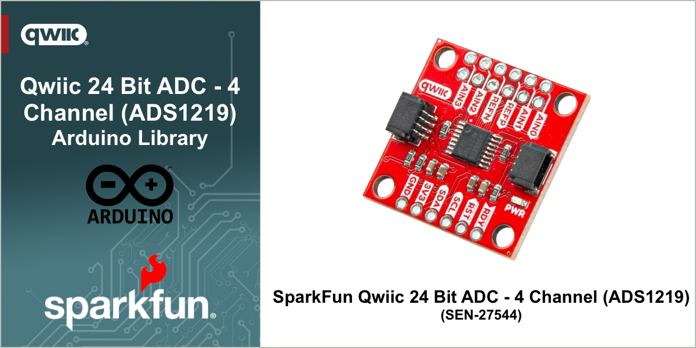

# SparkFun ADS1219 Arduino Library

<!--  Update this with a single sentence about this library -->

Arduino Library for the SparkFun ADS1219 Qwiic 24-Bit ADC adds four channels of high-precision, 24-bit analog input to your project over I2C, featuring programmable gain and up to 16 unique addresses

<!-- 
 Update these links and URLs for the badges to work correctly
 -->

This is an Arduino Library for the ADS1219 24-bit 4-channel ADC from TI. It allows you to fully configure the ADC.
Examples are provided to show how to use: single-shot vs. continuous mode; the input multiplexer; gain;
different sample rates; and alternate I2C addresses. You can read the ADC voltage in millivolts (compensated for gain)
or as the raw signed value.

Note: this library needs the [SparkFun Toolkit](https://github.com/sparkfun/SparkFun_Toolkit).

# Repository Contents

* **/examples** - Example sketches for the library (.ino). Run these from the Arduino IDE.
* **/src** - Source files for the library (.cpp, .h).
* **/docs** - configuration files for the documentation.
* **keywords.txt** - Keywords from this library that will be highlighted in the Arduino IDE.
* **library.properties** - General library properties for the Arduino package manager.

# Documentation

 <!-- *Link to documentation for this library here* -->

* **[Library Documentation](https://docs.sparkfun.com/SparkFun_ADS1219_Arduino_Library/)** - Arduino Library Documentation for this repository.
* **[Hookup Guide](https://docs.sparkfun.com/SparkFun_Qwiic_ADC_ADS1219/)** - Hookup guide for the SparkFun ADS1219 Qwiic Board.
* **[Installing an Arduino Library Guide](https://learn.sparkfun.com/tutorials/installing-an-arduino-library)** - Basic information on how to install an Arduino library.
* **[Hardware GitHub Repository - Qwiic 1x1](https://github.com/sparkfunX/SparkX_ADC_ADS1219)** - Main repository (including hardware files) the SparkFun ADS1219 qwiic board

## Products That Use This Library

 <!-- List the SparkFun products that use this library here -->

* [ SEN-27544](https://www.sparkfun.com/sparkfun-qwiic-24-bit-adc-4-channel-ads1219.html) - SparkFun Qwiic 24 Bit ADC - 4 Channel (ADS1219)

## License Information

This product is ***open source***!

This product is licensed using the [MIT Open Source License](https://opensource.org/license/mit)

